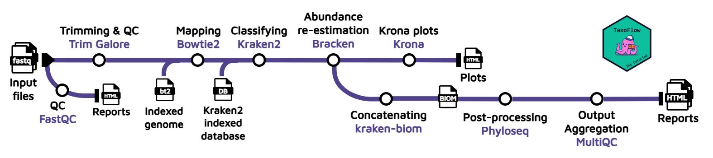

# Part 1: Method overview

In the field of metagenomics taxonomic classification or profiling, there is an endless universe of pipelines or methodologies you can follow to explore and characterize your samples.
We recommend this comprehensive [review/benchmark](https://www.nature.com/articles/s41597-024-03672-8) for you to explore the different existing approaches.
For this course, we propose to wrap with Nextflow the protocol published by [Jennifer Lu *et al.* (2022)](https://www.nature.com/articles/s41596-022-00738-y).

The example dataset we will use to demonstrate the analysis consists of only paired-end reads recovered from an oligotrophic, phosphorus-deficient pond in Cuatro Ciénegas, Mexico ([Okie *et al.*, 2020](https://elifesciences.org/articles/49816)) in FASTQ format.
The BioProject accession number is [PRJEB22811](https://www.ncbi.nlm.nih.gov/bioproject/PRJEB22811).

---

## 1. Workflow design

Our goal is to develop a workflow that takes **FASTQ** files from one or multiple samples as input and applies the following processing steps: initial quality screening, read trimming, host removal, taxonomic classification, Bayesian re-estimation of species abundance, and generation of plots and metrics.

To perform these steps, we will use the following tools:

1. **Quality control** on the read data before trimming using [**FastQC**](https://www.bioinformatics.babraham.ac.uk/projects/fastqc/).
2. **Trimming adapter sequences** and perform QC after trimming using [**Trim Galore**](https://github.com/FelixKrueger/TrimGalore) (bundles Cutadapt and FastQC).
3. **Host removal** with [**Bowtie2**](https://bowtie-bio.sourceforge.net/bowtie2/manual.shtml) by aligning the reads against an indexed reference genome.
4. **Taxonomic classification** with [**Kraken2**](https://ccb.jhu.edu/software/kraken2/). This tool relies on an indexed database that can be [downloaded](https://benlangmead.github.io/aws-indexes/k2). Here, we will use the custom database with 50 bacterial species that we have selected only for the purpose of this tutorial. However, you can expand the annotation simply by switching to another database.
5. **Bayesian re-estimation of species abundance** with [**Bracken**](https://ccb.jhu.edu/software/bracken/index.shtml?t=manual). This software is designed to compute species abundance using Kraken classification results as described in the reference paper. It also uses some files contained in the database folders such as the kmer distribution files. This is a fairly complex analysis, but you don't need to know the details in order to follow this tutorial; you can learn about how the method works afterwards.
6. **Plot generation** with [**Krona**](https://bmcbioinformatics.biomedcentral.com/articles/10.1186/1471-2105-12-385) from the Bracken output. This will allow us to visualize interactively the relative abundance of each annotated species.
7. (Multi-sample) **Concatenation with kraken-biom.** If multiple samples are provided, the Bracken reports will be concatenated and converted into a [Biological Observation Matrix (BIOM)](https://biom-format.org/) file.
8. (Multi-sample) **Generation of final report with Phyloseq**. The BIOM file will be converted to a [Phyloseq](https://joey711.github.io/phyloseq/index.html) object, and this object will be further processed to generate absolute plots, estimate both α and β-diversity and perform a network analysis. This information will be presented in a final `report.html`. To learn more about the code used to generate the plots and metrics, check out this Phyloseq [tutorial](https://vaulot.github.io/tutorials/Phyloseq_tutorial.html).

9. (Multi-sample) **Compilation of multiple tool outputs through [MultiQC](https://seqera.io/multiqc/)**. The outputs from FastQC, Trim Galore and Kraken2 are aggregated into a single, comprehensive and interactive report.

The specific versions used by the current version of Taxoflow for each tool are as follows:

??? info "Specific software versions"
    | Tool        | Version | Container\* (Seqera\*\*)                                                     | License      |
    | ----------- | ------: | ------------------------------------------------------------------------- | ------------ |
    | fastQC     |   0.12.1 | trim-galore:0.6.10--1bf8ca4e1967cd18 | GPL-3.0          |
    | Trim Galore     |   0.6.10 | trim-galore:0.6.10--1bf8ca4e1967cd18 | GPL-3.0          |
    | Bowtie2     |   2.5.4 | bowtie2:2.5.4--d51920539234bea7                                           | GPL-3.0      |
    | Kraken2     |    2.14 | kraken2:2.14--83aa57048e304f01                                            | MIT          |
    | Bracken     |     3.1 | bracken:3.1--22a4e66ce04c5e01                                             | GPL-3.0      |
    | KrakenTools |     1.2 | krakentools:1.2--db94e0b19cfa397b                                         | GPL-3.0      |
    | Krona       |   2.8.1 | krona:2.8.1--2f750080982f027e                                             | BSD          |
    | Kraken-BIOM |   1.2.0 | kraken-biom:1.2.0--f040ab91c9691136                                       | MIT          |
    | R           |   4.4.3 | bioconductor-phyloseq_knit_r-base_r-ggplot2_r-rmdformats:6efceb52eb05eb44 | GPL-2,3 |
    | Phyloseq    |  1.50.0 | bioconductor-phyloseq_knit_r-base_r-ggplot2_r-rmdformats:6efceb52eb05eb44 | AGPL-3       |
    | ggplot2     |   3.5.1 | bioconductor-phyloseq_knit_r-base_r-ggplot2_r-rmdformats:6efceb52eb05eb44 | MIT          |

    \* Containers found at: [community.wave.seqera.io/library/](https://community.wave.seqera.io/browse/library)

    ** Containers compatible with Docker engine.

??? licensing "Pipeline and tools license"
    Please keep in mind that TaxoFlow (both the tutorial and the Nextflow code) is released under an open-source license ([CC BY-NC-SA](https://creativecommons.org/licenses/by-nc-sa/4.0/)) for the benefit of the community. However, the encompassed tools feature different licenses that may affect your further implementation of TaxoFlow, and hence we encourage you to review carefully the terms of each individual license.

!!!tip

    If you feel a bit overwhelmed by the theoretical background of the methodology, we strongly encourage you to check this [Carpentries](https://carpentries-lab.github.io/metagenomics-analysis/) lesson first, where the concepts are explained step by step using interesting examples.

## 2. Databases and indexed genomes

As mentioned before, this tutorial provides with an indexed genome for Bowtie2 and a really reduced Kraken2/Bracken database to execute the pipeline. However, please keep in mind that the outcomes of the pipeline are not biologically meaningful if these resources are used on real data sets. At the moment of running the workflow with your own data, you must ensure that the proper database and indexed genome are used. Thus, we hereby provided you with repositories with already pre-compiled Kraken2/Bracken databases and indexed Bowtie2 genomes for the most popular organisms.

 - Kraken2/Bracken databases: [https://benlangmead.github.io/aws-indexes/k2](https://benlangmead.github.io/aws-indexes/k2)

 - Bowtie2 indexed genomes: [https://benlangmead.github.io/aws-indexes/bowtie](https://benlangmead.github.io/aws-indexes/bowtie)

 Also, it is possible to build your own databases and indexed genomes. You can find the tutorials here:

 - Build Kraken2 database (until step 6): [https://hackmd.io/@MEC-lab-team/SyvOOB0skl](https://hackmd.io/@MEC-lab-team/SyvOOB0skl)

 - Additional option to customize Kraken2 database: [https://avilpage.com/2024/07/mastering-kraken2-build-custom-db.html](https://avilpage.com/2024/07/mastering-kraken2-build-custom-db.html)

 - Build Bowtie2 index: [https://www.metagenomics.wiki/tools/bowtie2/index](https://www.metagenomics.wiki/tools/bowtie2/index)

## 3. Validation

We used TaxoFlow to analyze the sequences [SRR32316197](https://www.ncbi.nlm.nih.gov/sra/?term=SRR32316197) belonging to the mock community (ZymoBIOMICS™ Microbial Community DNA Standard D6305) in combination with the Kraken2 database PlusPFP (Standard plus Refseq protozoa, fungi & plant) v04/09/2024. This analysis shows the correct estimation of the community member proportions according to the manufacturer specifications. The resulting files of this analysis were deposited on Zenodo under the identifier [16947911](https://doi.org/10.5281/zenodo.16947911) and with the filename *mock_community.tar.gz*.

---

### Takeaway

You understand the underlying method and the overall design of the workflow.

### What's next?

Learn how to wrap those same commands into a multi-step workflow that uses containers to execute the work.
