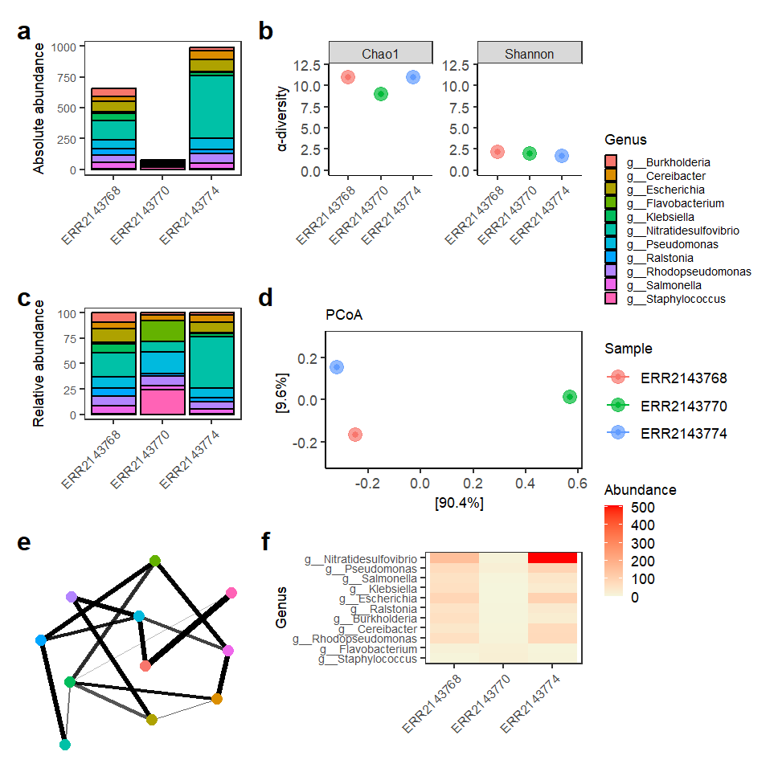
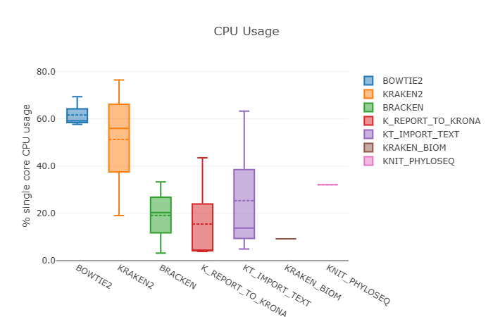

# Part 3: Multi-sample analysis

In this part, we are going to start from the pipeline structure we built in the previous part and extend it for multi-sample analysis.

!!!note
    We will be working now in the `multi` directory. Thus, please make sure you are in the correct directory and move the data:
    ```bash
    cd /workspaces/taxoflow_tutorial/TaxoFlow/multi
    mv ../single/data .
    ```

This will give us the opportunity to practice using the following Nextflow features:

1. Using a Nextflow operator to control the flow of data
2. Controlling the execution of modules according to an input condition
3. Including a process that runs a customized script
4. Generate a performance report

---

## 1. Multi-sample input

With our shiny brand-new pipeline, we are at this moment able to analyze each sample individually by running the workflow multiple times.
Nonetheless, one of the most powerful capabilities by Nextflow is its native parallel execution according to the available resources the executor finds.
You can think of this as a sort of "integrated *for* loop" that will process all the samples in parallel in a single run without the need of re-running the pipeline. 

??? info "Nextflow´s parallelization"

    Formally speaking, Nextflow's parallelization is implicitly defined by the processes input and output declarations, or in other words, Nextflow uses asynchronous first-in, first-out (FIFO) queues or channels. If you want to know more about this, we recomend this [section](https://training.nextflow.io/2.1.3/basic_training/intro/) of the official documentation.

To achieve this purpose, there are two possibilities:

- The use of wildcards in the input (this can be tricky and requires taking into account particular folder structures).
- Create a file that points out to the sample files regardless of their location in the file system.

In this course, we will target the second input option, but you are welcome to explore how you can use the first option by checking out the [Nextflow documentation](https://www.nextflow.io/docs/latest/working-with-files.html).

To move forward, let's create the file `samplesheet.csv` inside the folder `data/`:

```csv title="data/samplesheet.csv" linenums="1"
sample_id,fastq_1,fastq_2
ERR2143768,data/samples/ERR2143768/ERR2143768_1.fastq.gz,data/samples/ERR2143768/ERR2143768_2.fastq.gz
ERR2143770,data/samples/ERR2143770/ERR2143770_1.fastq.gz,data/samples/ERR2143770/ERR2143770_2.fastq.gz
ERR2143774,data/samples/ERR2143774/ERR2143774_1.fastq.gz,data/samples/ERR2143774/ERR2143774_2.fastq.gz
```

Here, we have provided the `sample id` and the absolute paths to both forward and reverse reads per sample.
Please notice that the files are not required to be stored in the directory; however, this is recommended in order to maintain a consistent fodirectorylder structure.

However, we cannot use this file as input in the current state of the pipeline, given that it expects only a path to create a paired-end channel.
So let's include an additional parameter in the `multi/nextflow.config` file (inside the parameter block, keeping the same structure):

```groovy title="multi/nextflow.config" linenums="10"
sheet_csv                             = null
```

We initialize this parameter as `null` since it can be used or not.

Now, we need to modify the `main.nf` file to state how the input should be handled depending on the type of input:

```groovy title="main.nf" linenums="22"
if(params.reads){
	reads_ch = Channel.fromFilePairs(params.reads, checkIfExists:true)
} else {
	reads_ch = Channel.fromPath(params.sheet_csv)
			.splitCsv(header:true)
			.map {row-> tuple(row.sample_id, [file(row.fastq_1), file(row.fastq_2)])}
}
```

This modified declaration states that if we use the parameter `--reads` when we invoke the `nextflow run main.nf`, the _reads_ channel will be created using only the path to paired-end files.
Otherwise, we must include the parameter `--sheet_csv` with the corresponding file containing the sample information.

### 1.1 Conditional execution with `if` statements

TaxoFlow showcases **two layers** of conditional logic:

- At the **top‑level workflow** (`main.nf`) to decide how to build the read channel.
- Inside the **`TaxoFlow` workflow** (`taxoflow.nf`) to decide whether to run downstream reporting steps (shown in section **3. Conditional reporting inside `taxoflow.nf`**).

The `if` statement decides **how inputs are parsed**:

- **Branch 1 – `params.reads` is set**:
    - Use `channel.fromFilePairs(params.reads, checkIfExists:true)` to build a channel of paired‑end read files directly from a glob pattern.
    - This is convenient when your reads are already organised on disk and you do not need a sample sheet.
- **Branch 2 – `params.reads` is not set**:
    - Use `channel.fromPath(params.sheet_csv)` followed by `.splitCsv(header:true)` to read a CSV samplesheet.
    - Map each row into a tuple: `tuple(row.sample_id, [file(row.fastq_1), file(row.fastq_2)])`.
    - This is useful when metadata such as `sample_id` is stored in a table.

In both cases the result is a **single channel `reads_ch`** that emits:

- A `sample_id` value.
- A list with the two FASTQ files.

The rest of the pipeline (`TaxoFlow(...)`) is **independent of how `reads_ch` was created**, illustrating a common pattern:

- Use `if` blocks early in the workflow to normalize different input formats into a **canonical channel shape**.

??? tip "If structure"
    Abstracting the `if` block from `main.nf`:
        ```groovy title="if statement" linenums="1"
        if(condition){
            do something
        } else {
            do something different
        }
        ```
    The `else` statement is not always required.

Being so, it is necessary to use one of the two forms of input; if we use both at the same time, the `--reads` will predominate or if none of them is indicated, the pipeline will fail.
Do not worry now for the way in which channel is created using the `.csv` file, this declaration is quite standard and you can just copy and paste for other pipelines in which you would like to use it; however, you can learn more about this [here](https://nextflow-io.github.io/patterns/process-per-csv-record/).

Now, we would be ready to re-run the pipeline to process all the samples in a single call.
Notwithstanding, the inclusion of additional samples has the advantage that we can expand the analysis to estimate β-diversity and compare them to extract important insights.

---

## 2. Additional processes

### 2.1. Kraken-biom

Let's create a new module that is going to handle the Bracken output to produce a Biological Observation Matrix (BIOM) file that concatenates the species abundance in each sample.

The `kraken_biom.nf` file will be located in the `multi/modules/` directory:

```groovy title="multi/modules/kraken_biom.nf" linenums="1"
process KRAKEN_BIOM {
    tag "merge_samples"
    container "community.wave.seqera.io/library/kraken-biom:1.2.0--f040ab91c9691136"

    input:
    val "files"

    output:
    path "merged.biom"

    script:
    """
    list=(${files.join(' ')})
    extracted=\$(echo "\${list[@]}" | tr ' ' '\n' | awk 'NR % 3 == 2')
    kraken-biom \${extracted} --fmt json -o merged.biom
    """
    }
```

This process will _collect_ each output from the Bracken files to build a single `*.biom` file that contains the abundance species data of all the samples.
In the `script` statement we find three tasks to execute, the first two lines are for variable manipulation required to handle the type of input this process receives (more about this when modifying `multi/taxoflow.nf` below), and the second line executes the kraken-biom command that is available thanks to specified container.

#### 2.1.1. Operator _collect()_ and conditional execution

Nextflow provides a high number of operators that smooth data handling and orchestrates the workflow to do exactly what we want.
In this case, the process `KRAKEN_BIOM` requires all the files produced by Bracken belonging to each sample, which means that `KRAKEN_BIOM` can not be triggered until all Bracken processes are finished.
For this task, the operator _collect()_ comes really handy, and therefore let's include it in our `multi/taxoflow.nf`... but wait!
Let's recall that `KRAKEN_BIOM` and the following `KNIT_PHYLOSEQ` are only triggered if the execution is aiming at processing more than one sample.
Being so, we will include these processes and modify the workflow execution to add the conditional statement in `multi/taxoflow.nf`:

```groovy title="multi/taxoflow.nf" linenums="11"
include { KRAKEN_BIOM               }   from './modules/kraken_biom.nf'
```

```groovy title="multi/taxoflow.nf" linenums="35"
if(params.sheet_csv){
	KRAKEN_BIOM(BRACKEN.out.collect())
}
```

Here, you can see that we have added the operator _collect()_ to capture all the output files from `BRACKEN`, and this is happening only if we are using `--sheet_csv` as input.
This operator is going to return a list of the elements specified in the output of the process (`BRACKEN`), and, for instance, we are interested in each "second" (indices 1,4,7...) element of the list to run the _kraken-biom_ command; this is the reason why within the `script` statement in `multi/modules/kraken_biom.nf` we have included two codelines to obtain the paths to these files.
If this is not entirely clear, please check the [Nextflow documentation](https://www.nextflow.io/docs/latest/reference/operator.html#collect).

### 2.2. Phyloseq

#### 2.2.1. Including a customized script

We are at the last step of the pipeline execution, and now we need to process the `*.biom` file by transforming it into a Phyloseq object, which is easier to use, more intuitive to understand, and is equipped with multiple tools and methods to plot.
Another amazing feature by Nextflow is the possibility to run the so-called _Scripts à la carte_, which means that a process does not necessarily require an external tool to execute, and hence you can develop your own analysis with customized scripts, i.e., R or Python.
Here, we will run an R script inside the module `multi/modules/knit_phyloseq.nf` to create and process the Phyloseq object taking as input the output from `multi/modules/kraken_biom.nf`:

```groovy title="multi/modules/knit_phyloseq.nf" linenums="1"
process KNIT_PHYLOSEQ {
    tag "knit_phyloseq"
    container "community.wave.seqera.io/library/bioconductor-phyloseq_knit_r-base_r-ggplot2_r-rmdformats:6efceb52eb05eb44"

    input:
    path "merged"

    output:
    stdout

    script:
    def report = params.report
    def outdir = params.outdir
    """
    biom_path=\$(realpath ${merged})
    outreport=\$(realpath ${outdir})
    Rscript -e "rmarkdown::render('${report}', params=list(args='\${biom_path}'),output_file='\${outreport}/taxoReport.html')"
    """
    }
```

??? tip "Global vs Nextflow variables"
    Within the `modules/knit_phyloseq.nf` you can notice that some variables like `biom_pat` and `outreport` are preceded by a backslash (\\). In Nextflow, it is really important to distinguish Nextflow variables from Bash or environment variables. This is achieved through the use of double quotes in the script section plus adding the _escape_ character (backslash) **before Bash variables**. [More about this here](https://docs.seqera.io/nextflow/process#script:~:text=the%20pipeline%20script.-,WARNING,-Since%20Nextflow%20uses).

As you can see, we are declaring some variables both in Nextflow and bash to be able to call the script.
This is a special case since this type of scripts can be stored in the **bin** directory for Nextflow to find them directly.
Nevertheless, as we are not "running the script" directly but we are calling `Rscript` to render a final `*.html` report, Nextflow is not able to automatically find the customized script nor detect when the report is rendered.
As a result the output from this process is just a standard/command-line output, and we have to include an additional parameter in the `multi/nextflow.config` file:

```groovy title="multi/nextflow.config" linenums="11"
report                             = "${projectDir}/bin/report.Rmd"
```

This R Markdown file uses a Phyloseq object created from Kraken2/Bracken output (BIOM file), then applies standard functions from for diversity and network analysis. Thus, results should therefore be interpreted as **visual summaries of community structure**, not as statistically validated differences.

??? info "Diversity and network analysis methods"

    **Input data**  
    Taxonomic abundance tables generated with Bracken were imported into R as a Phyloseq object. Taxa were agglomerated at the **genus level** (`tax_glom`), and low-abundance genera were filtered by retaining taxa with a **mean relative abundance ≥ 3%** across samples.

    **α-diversity (within-sample diversity)**

    - Calculated using `plot_richness()` from Phyloseq.
    - Diversity indices:
        - **Chao1**: richness estimator accounting for unseen taxa.
        - **Shannon**: richness and evenness estimator.
    - **Normalization:** raw abundance counts were used directly (no rarefaction or scaling).

    **β-diversity (among-sample diversity)**

    - Community dissimilarity calculated using **Bray–Curtis distance**.
    - Ordination performed with **Principal Coordinates Analysis (PCoA)**.
    - Visualizations:
        - Heatmap of taxonomic abundance with sample ordering based on ordination.
        - PCoA scatter plot for comparing sample composition.
    - **Normalization:** Bray–Curtis calculated directly from the filtered abundance table.

    **Network construction**

    - Generated using `plot_net()` from Phyloseq.
    - Parameters:
        - **Distance metric:** Bray–Curtis.
        - **Network type:** taxa co-occurrence (`type = "taxa"`).
        - **Maximum distance threshold:** `maxdist = 0.9`.
    - Nodes represent genera; edges connect taxa based on pairwise similarity under the defined threshold.

    **Statistical testing**

    This workflow provides **descriptive and exploratory analysis only**. Results should therefore be interpreted as **visual summaries of community structure**, not as statistically validated differences. Please visit the [microbiome R package tutorial](https://microbiome.github.io/tutorials/) for expanding the statistical analysis of microbiome data.

In addition, please notice the `container` used for the `KNIT_PHYLOSEQ`, which is combination of multiple packages required to render the `*.html` report.
This is possible thanks to [Seqera Containers](https://seqera.io/containers/), which is able to build almost any container (for docker or singularity!) by just "merging" different PyPI or Conda packages.

Also, we have to include this new process within `multi/taxoflow.nf`:

```groovy title="multi/taxoflow.nf" linenums="12"
include { KNIT_PHYLOSEQ             }   from './modules/knit_phyloseq.nf'
```

We need to call it as well inside the conditional execution if multi-sample is being handled:

```groovy title="multi/taxoflow.nf" linenums="37"
KNIT_PHYLOSEQ(KRAKEN_BIOM.out)
```

### 2.3. MultiQC

As noted in the method overview, the last step of the multi-sample workflow is to compile quality-control results from several tools into a single interactive report using [**MultiQC**](https://seqera.io/multiqc/).

While FastQC, Trim Galore, and Kraken2 each produce their own reports per sample, MultiQC scans those outputs and builds one HTML summary that makes it easier to compare samples side by side.

Let's create the `multiqc.nf` file inside the `multi/modules/` directory:

```groovy title="multi/modules/multiqc.nf" linenums="1"
process MULTIQC {
    tag "All samples"
    container "community.wave.seqera.io/library/pip_multiqc:a3c26f6199d64b7c"

    input:
    path '*'
    val output_name

    output:
    path "${output_name}.html", emit: report
    path "${output_name}_data", emit: data

    script:
    """
    multiqc . -n ${output_name}.html
    """
    }
```

This process runs **once** for the whole pipeline run, after all per-sample QC tasks have finished.
Unlike the per-sample modules, its `tag` is fixed to `"All samples"` because it does not process reads from a single sample in isolation.

#### 2.3.1. Process inputs

The `input` block expects two arguments:

- `path '*'` — a collection of report files from FastQC, Trim Galore, and Kraken2.
  Nextflow stages all of these files in the process work directory before the command runs.
- `val output_name` — the base name for the final report (in our case, this comes from `params.report_id`).

#### 2.3.2. Process outputs

MultiQC produces two outputs:

- `${output_name}.html` (emitted as `report`) — the interactive summary report you open in a browser.
- `${output_name}_data` (emitted as `data`) — a folder with the parsed data MultiQC used to build the report.

#### 2.3.3. Command script

The `script` block runs a single command: `multiqc . -n ${output_name}.html`.
MultiQC scans the current directory (`.`) for recognized report formats and writes the combined HTML file.
The `-n` flag sets the output file name.

#### 2.3.4. Modify `taxoflow.nf`

First, import the new module at the top of `multi/taxoflow.nf`:

```groovy title="multi/taxoflow.nf" linenums="13"
include { MULTIQC                     }  from './modules/multiqc.nf'
```

Next, we need to **gather** the QC files produced across all samples before calling `MULTIQC`.
Add the following lines inside the `main:` block of the `TaxoFlow` workflow, after the per-sample processes:

```groovy title="multi/taxoflow.nf" linenums="39"
multiqc_files_ch = channel.empty().mix(
FASTQC.out.zip,
FASTQC.out.html,
TRIM_GALORE.out.trimming_reports,
TRIM_GALORE.out.fastqc_reports_1,
TRIM_GALORE.out.fastqc_reports_2,
KRAKEN2.out.report,
BOWTIE2.out.log
)
multiqc_files_list = multiqc_files_ch.collect()
MULTIQC(multiqc_files_list, params.report_id)
```

Here is what each part does:

- `channel.empty().mix(...)` starts from an empty channel and **merges** several channels into one.
  Each channel contributes files from a different step: FastQC (before trimming), Trim Galore (trimming reports and post-trim FastQC), and Kraken2 (`.k2report` files).

??? tip "Operator mix()"
    The mix operator combines the items emitted by two (or more) channels. More [here](https://training.nextflow.io/2.2/basic_training/operators/#mix).

- As explained before, `.collect()` waits until **all** samples have finished the upstream processes, then bundles every file into a single list.
  This is what allows `MULTIQC` to run only once, with inputs from every sample.
- `MULTIQC(multiqc_files_list, params.report_id)` passes that list and the report name to the process.

Unlike `KRAKEN_BIOM` and `KNIT_PHYLOSEQ`, MultiQC runs **every time** the pipeline runs, whether you use `--reads` or `--sheet_csv`.

Finally, expose the MultiQC outputs in the `emit` block:

```groovy title="multi/taxoflow.nf" linenums="62"
multiqc_report           =    MULTIQC.out.report
multiqc_data             =    MULTIQC.out.data
```

#### 2.3.5. Modify `main.nf`

We need to publish the MultiQC results in `multi/main.nf`, alongside the other outputs from `TaxoFlow`.

Add these lines to the `publish` block:

```groovy title="multi/main.nf" linenums="45"
multiqc_report          =    TaxoFlow.out.multiqc_report
multiqc_data            =    TaxoFlow.out.multiqc_data
```

And assign a destination folder in the `output` block:

```groovy title="multi/main.nf" linenums="85"
multiqc_report {
    path 'multiqc'
}
multiqc_data {
    path 'multiqc'
}
```

When the pipeline finishes, you will find `all_samples.html` (or whatever name you set in `params.report_id`) and the companion `all_samples_data` folder under `output/multiqc/`.

#### 2.3.6. Parameter in `nextflow.config`

Add the following parameter to the `params` block in `multi/nextflow.config`:

```groovy title="multi/nextflow.config" linenums="12"
report_id                             = "all_samples"
```

This value is passed to `MULTIQC` as the output name.
You can change it at run time, for example: `--report_id 'cuatro_cienegas_run'`. That would produce `cuatro_cienegas_run.html` instead of `all_samples.html`.

#### 2.3.7. Adaptation of Bowtie2

In order to include Bowtie2's output into the final MultiQC report, we need to modify the module itself, along with additions to `main.nf` and `taxoflow.nf`:

- Changes in `bowtie2.nf`:

??? terminal "`bowtie2.nf`"
    ```groovy title="multi/modules/bowtie2.nf" linenums="1" hl_lines="10 11 16"
    process BOWTIE2 {
    tag "${sample_id}"
    container "community.wave.seqera.io/library/bowtie2:2.5.4--d51920539234bea7"

    input:
    tuple val(sample_id), path(read1), path(read2)
    path bowtie2_index

    output:
    tuple val("${sample_id}"), path("${sample_id}.1"), path("${sample_id}.2"), path("${sample_id}.sam"), emit: reads
    path "${sample_id}_aln_sum.log", emit: log

    script:
    """
    export BOWTIE2_INDEXES=/workspaces/taxoflow_tutorial/TaxoFlow/multi/data/genome/TAIR10
    (bowtie2 -x $bowtie2_index -1 ${read1} -2 ${read2} -p 2 -S ${sample_id}.sam --un-conc-gz ${sample_id}) 2> ${sample_id}_aln_sum.log
    """
    }
    ```

??? tip "Getting the `stderr` of Bowtie2"
    Bowtie2 places its output regarding the number of aligned reads to a common CLI output channel known as **stderr**. Thus, to capture this information we had to modify the command by using braces and create the file where we want the stderr to be stored. This file will be used by MultiQC to build the report.


- Changes in `taxoflow.nf`:

??? terminal "`taxoflow.nf`"
    ```groovy title="multi/taxoflow.nf" linenums="19" hl_lines="13 28 34-35"
    workflow TaxoFlow {
    // required inputs
    take:
        bowtie2_index
        kraken2_db
        reads_ch
    // workflow implementation
    main:
         // Initial quality control
        FASTQC(reads_ch)
        TRIM_GALORE(reads_ch)
        BOWTIE2(TRIM_GALORE.out.trimmed_reads, bowtie2_index)
        KRAKEN2(BOWTIE2.out.reads, kraken2_db)
        BRACKEN(KRAKEN2.out.files, kraken2_db)
        K_REPORT_TO_KRONA(BRACKEN.out)
        KT_IMPORT_TEXT(K_REPORT_TO_KRONA.out)
        if(params.sheet_csv){
            KRAKEN_BIOM(BRACKEN.out.collect())
            KNIT_PHYLOSEQ(KRAKEN_BIOM.out)
        }
        multiqc_files_ch = channel.empty().mix(
        FASTQC.out.zip,
        FASTQC.out.html,
        TRIM_GALORE.out.trimming_reports,
        TRIM_GALORE.out.fastqc_reports_1,
        TRIM_GALORE.out.fastqc_reports_2,
        KRAKEN2.out.report
        BOWTIE2.out.log
        )
    multiqc_files_list = multiqc_files_ch.collect()
    MULTIQC(multiqc_files_list, params.report_id)

    emit:
        bowtie_log               =    BOWTIE.out.log
        bowtie_unali             =    BOWTIE2.out.reads
        kraken_class             =    KRAKEN2.out.files
        bracken_class            =    BRACKEN.out
        krona                    =    KT_IMPORT_TEXT.out
        biom                     =    KRAKEN_BIOM.out
        fastqc_zip               =    FASTQC.out.zip
        fastqc_html              =    FASTQC.out.html
        trimmed_reads            =    TRIM_GALORE.out.trimmed_reads
        trimming_reports         =    TRIM_GALORE.out.trimming_reports
        trimming_fastqc_1        =    TRIM_GALORE.out.fastqc_reports_1
        trimming_fastqc_2        =    TRIM_GALORE.out.fastqc_reports_2
        multiqc_report           =    MULTIQC.out.report
        multiqc_data             =    MULTIQC.out.data
    }
    ```

- Additions in `main.nf`:

??? terminal "`main.nf`"
    ```groovy title="multi/main.nf" linenums="34"
    bowtie_log              =    TaxoFlow.out.bowtie_log
    ```

    ```groovy title="multi/main.nf" linenums="53"
    bowtie_log {
        path 'bowtie2'
    }
    ```

---

## 3. Conditional reporting inside `taxoflow.nf`

The inner `if (params.sheet_csv)` in `taxoflow.nf` controls whether to:

- **Merge Bracken outputs across samples** with `KRAKEN_BIOM(BRACKEN.out.collect())`.
- **Render a Phyloseq HTML report** with `KNIT_PHYLOSEQ(KRAKEN_BIOM.out)`.

Key ideas:

- When running from a **samplesheet**, we know which samples belong together, so it makes sense to aggregate them into a single biom file and downstream report.
- When running from **raw file pairs only** (`params.reads`), `params.sheet_csv` is `null` in `nextflow.config`, so the extra report is skipped.

This is a clean way to:

- Keep **core processing** always enabled.
- Toggle **extra reporting or QC steps** based on parameters.

---

## 4. Enabling the built‑in report

In `nextflow.config`:

```groovy title="multi/nextflow.config" linenums="22"
report {
    enabled = true
    file = "${projectDir}/output/performanceReport.html"
}
```

This block tells Nextflow to:

- Generate a **single HTML report** named `performanceReport.html` at the end of each run.
- Place it in the **results directory** from where you launched Nextflow. Please notice that this is a **custom path**. It does not take from `params.outdir`, and thus if `outdir` is changed, the report will not be stored on the new output directory.
- Keep all outputs (taxonomy results, Krona plots, RMarkdown report, MultiQC output,Nextflow report) under a single `output/` tree.

You do not need to change `main.nf` or `taxoflow.nf` to use this feature; it is entirely controlled by configuration.

??? info "Enabling the report as a parameter"
    It is possible to generate the report just by adding the parameter `-with-report <file_name>` when executing the pipeline. [More about this here](https://docs.seqera.io/nextflow/reports#execution-report).

---

## 5. Execution

Now, we are completely set to run the analysis for as many samples as we would like, and we will obtain a final report depicting different metrics regarding taxonomic abundance, network analysis, and α and β-diversity. Let's execute (please remember that we are within the **multi** directory):

```bash
nextflow run main.nf --sheet_csv 'data/samplesheet.csv'
```

On the output of the command line, you will see:

??? success "Multi-sample execution"
    ```console title="Output"
    N E X T F L O W   ~  version 25.10.4

    Launching `main.nf` [stoic_miescher] DSL2 - revision: 8f65b983e6

        ___________________________________________________________________________________________________
        ___________________________________________________________________________________________________
        >===>>=====>                                 >=======>  >=>                         
            >=>                                      >=>        >=>                         
            >=>        >=> >=>  >=>   >=>    >=>     >=>        >=>    >=>     >=>      >=> 
            >=>      >=>   >=>    >> >=>   >=>  >=>  >=====>    >=>  >=>  >=>   >=>  >  >=> 
            >=>     >=>    >=>     >>     >=>    >=> >=>        >=> >=>    >=>  >=> >>  >=> 
            >=>      >=>   >=>   >>  >=>   >=>  >=>  >=>        >=>  >=>  >=>   >=>>  >=>=> 
            >=>       >==>>>==> >=>   >=>    >=>     >=>       >==>    >=>     >==>    >==>     
                                                                                                        
        ___________________________________________________________________________________________________
        ___________________________________________________________________________________________________

    executor >  local (24)
    [1f/176196] TaxoFlow:FASTQC (ERR2143768)            [100%] 3 of 3 ✔
    [c5/42b877] TaxoFlow:TRIM_GALORE (ERR2143774)       [100%] 3 of 3 ✔
    [da/6ba52f] TaxoFlow:BOWTIE2 (ERR2143774)           [100%] 3 of 3 ✔
    [45/054c41] TaxoFlow:KRAKEN2 (ERR2143774)           [100%] 3 of 3 ✔
    [30/94f39e] TaxoFlow:BRACKEN (ERR2143774)           [100%] 3 of 3 ✔
    [67/1dabc3] TaxoFlow:K_REPORT_TO_KRONA (ERR2143774) [100%] 3 of 3 ✔
    [ed/8bf05a] TaxoFlow:KT_IMPORT_TEXT (ERR2143774)    [100%] 3 of 3 ✔
    [b2/cfd842] TaxoFlow:KRAKEN_BIOM (merge_samples)    [100%] 1 of 1 ✔
    [cb/815f36] TaxoFlow:KNIT_PHYLOSEQ (knit_phyloseq)  [100%] 1 of 1 ✔
    [7f/b77259] TaxoFlow:MULTIQC (All samples)          [100%] 1 of 1 ✔

    Completed at: 27-Nov-2025 13:03:40
    Duration    : 1m 36s
    CPU hours   : (a few seconds)
    Succeeded   : 10
    ```

??? tip "Use your own data"
	If you want to use your own data, you just need to change sample IDs and the paths to sequencing reads on the file `data/samplesheet.csv`, or create your own one to use it with the parameter `--sheet_csv`.

Keep in mind that since the execution is in parallel, the order in which the samples are processed is random and the order in which `sample ids` appear will differ among executions.
Also, while the pipeline is running you will see that `KRAKEN_BIOM`, and hence `KNIT_PHYLOSEQ`, will not be triggered until all the samples are processed by the previous processes.

Finally, inside the **output** directory, you will see multiple folders with the exact `sample ids`, and within these all the output files, including the files to visualize the Krona plots.
Likewise, in the **output** folder you will see the file `TaxoReport.html` which is ready to be opened and explored. It's your time to analyze it!

Below you can see the plots included in the report, where it is possible to observe different metrics and general trends of annotated reads at genus level considering the custom database that we created for this tutorial with only 54 bacterial species (**we applied a filter to keep only genera with relative above 3%, and keep in mind that this is the Bracken output!**):

<div markdown class="metagenomics">



**Taxonomic composition and diversity analyses of metagenomic samples.** Absolute (a) and relative (c) abundance plots show the distribution of dominant genera across samples. α-diversity (b) was estimated using Chao1 and Shannon indices. β-diversity (d) was assessed by Principal Coordinates Analysis (PCoA) using Bray–Curtis distance. A co-occurrence network (e) shows relationships among genera based on Bray–Curtis similarity (`maxdist = 0.9`). A heatmap (f) displays genus abundance patterns across samples, ordered according to Bray–Curtis dissimilarity and PCoA. Low-abundance genera (<3% mean relative abundance) were removed before diversity and network analyses.

</div>

### 5.1 Performance report

Open the file `performanceReport.html` in a browser. You will find:

- A **timeline** of all tasks across processes like `FASTQC`, `BOWTIE2`, `KRAKEN2`, `BRACKEN`, etc.
- A **resources** table with CPU, memory and time usage per process.
- A **tasks** section showing how many samples were processed and how long each step took.

<figure markdown align="center">
  
  <figcaption>Plot example within the performance report.</figcaption>
</figure>

This native report complements the domain‑specific Phyloseq HTML:

- The **Nextflow report** focuses on **pipeline performance and resource usage**.
- The **Phyloseq report** focuses on **biological interpretation** of the metagenomic profiles.
- The **MultiQC report** focuses on **general statistics and metrics** aggregated from different tools.

## 6. Biological meaning

Once again, please remember that this execution of the pipeline, and therefore **it doesn't have a clear biological interpretation**. To extract truly insights from the samples hereby provided or your own data, you need to use the corresponding genome index and Kraken2/Bracken databases for you analysis purposes. Please check how to achieve this [here](01_pipeline.md#2-databases-and-indexed-genomes).

---

### Takeaway

You just learnt how to control workflow execution by including conditionals and operators, processing multiple samples simultaneously and running a customized script to perform a metagenomics data analysis at read level.

### What's next?

Great! You are well equipped now to start developing your own pipelines.