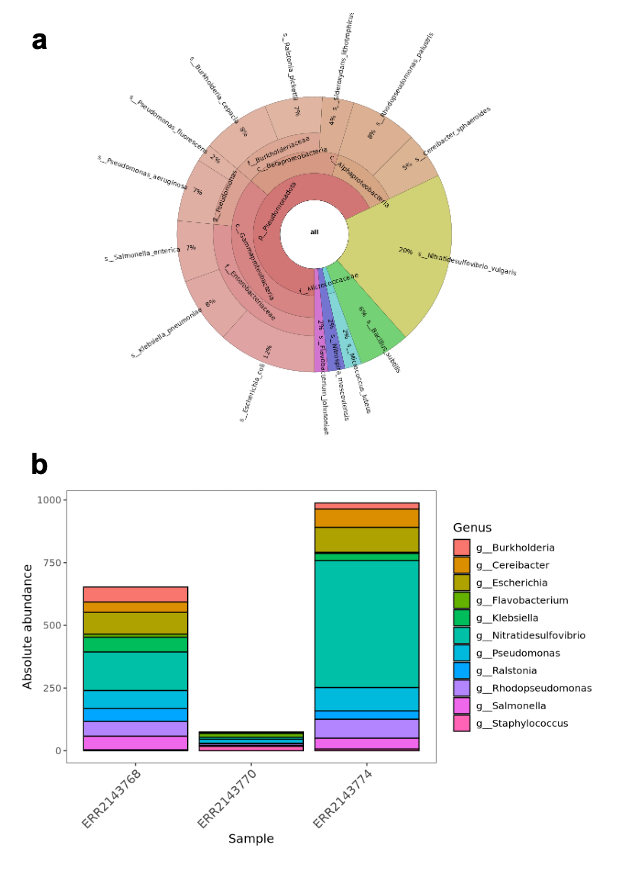

# Summary

Analysis reproducibility has become one of the main challenges for scientific reporting as it is critical to ensure transparent and comparable results. Metagenomics studies are not exempted from these concerning aspects, and hence bioinformatics pipelines to handle this type of data have evolved rapidly as an attempt to equip the research community with reliable methodologies and procedures. Nonetheless, as these workflows grow in robustness and complexity, inexperienced users find it difficult to understand or customize the pipelines. To address this limitation, we developed an open, interactive and web-based tutorial (TaxoFlow) that guides scholars through the detailed development of a validated and reproducible Nextflow metagenomics profiling pipeline. This workflow integrates software to remove host sequences (Bowtie2), a taxonomic classification (Kraken2), a tool for species abundance reestimation (Bracken) and different data visualization strategies. As important features, the tutorial emphasizes simplicity, modularity, and containerization, which empowers users with both conceptual understanding and practical implementation skills. Noteworthy, this tutorial provides all the required files, databases, dependencies, software and environment for the user to run without the need of local installation or computational adaptations elsewhere. Finally, by offering a fully reproducible pipeline with a step-by-step developing tutorial, this work aims to lower technical barriers in microbiome bioinformatics and promote best practices in metagenomics data analysis. TaxoFlow freely available at [https://taxoflow.work/](https://taxoflow.work).

# Statement of Need

In order to promote reproducibility and scalability in to perform taxonomic profiling during metagenomics studies, some Nextflow-based pipelines that encompass Kraken2 [@wood_improved_2019] and/or Bracken [@lu_bracken_2017] have been released, including nf-core/taxprofiler [@stamouli_nf-coretaxprofiler_2023], kraken-nf [@kraken-nf] wf-metagenomics [@wf-metagenomics], nxf-kraken2 [@nxf-kraken2], 16S-Metatranscriptomic-Analysis [@terron-camero_comparison_2022] and specific modules within the Bactopia [@petit_bactopia_2020] and nf-core [@langer_empowering_2025] suites. These workflows provide comprehensive implementations of metagenomic taxonomic classification software, integrating multiple profilers, database management steps, and reporting modules. Nonetheless, such pipelines feature a high number of parameters and an internal complex structure, making them challenging for inexperienced users to understand, modify or adapt to specific requirements. As a result, this “black box” nature of these useful and robust but sophisticated tools can hinder learning and flexibility. Furthermore, although there have been efforts to document training material to perform metagenomics data analysis [@zirion-martinez_data_2024], [@kruchten_curricular_2020] or to develop assembly-based Nextflow pipeline [@nextflow-example], there is a growing need for educational resources that provide the technical knowledge, materials, standardized computing environments and practical implementations to develop reproducible metagenomics-focused pipelines wrapped with workflow managers.

In this context, we developed an open, interactive and web-based tutorial (TaxoFlow) that guides users step-by-step through the creation of a simple yet complete Nextflow metagenomics pipeline. This tutorial is built on a reference protocol proposed by [@lu_metagenome_2022] that integrates the removal of host reads, Kraken2, Bracken, Krona plots and the generation of an HTML report to perform metagenomics taxonomic profiling in a container-based environment. The tutorial emphasizes conceptual understanding, modular pipeline design, and reproducibility, providing a practical entry point for researchers seeking to build or customize their own workflows.

# Content and Learning Objectives

TaxoFlow provides a practical and educational framework for developing a reproducible Nextflow workflow dedicated to metagenomics taxonomic profiling. Through this tutorial we are aiming at teaching both the conceptual foundations and technical implementation of reproducible data analysis, while producing biologically meaningful results using established tools such as Bowtie2 [@langmead_fast_2012], Kraken2 and Bracken. The resource is hosted at [https://taxoflow.work/](https://taxoflow.work) and offers an interactive, step-by-step learning experience complemented by commented code examples, schematic representations, and example datasets. It is worthy to mention that TaxoFlow assumes a basic familiarity with the command-line interface and provides links to complementary educational resources for users who wish to strengthen their background in Linux, Nextflow, or metagenomics data handling. In addition, it is designed for early-career researchers and students seeking to learn how workflow management systems can enhance reproducibility, scalability, and transparency in microbiome bioinformatics.

## Educational Scope and Learning Objectives

TaxoFlow presents the process of building a linear pipeline that performs host read removal, taxonomic classification and species abundance re-estimation through a progressive learning path to introduce important workflow concepts. This initial exercise establishes a foundation for understanding process definition, parameterization, and file handling in Nextflow. Afterwards, the users then learn how to manage domain-specific outputs to ensure reproducible downstream analyses.

A central feature of TaxoFlow is the introduction of Nextflow’s dataflow paradigm, which enables dynamic parallelization of analyses across multiple samples. In this sense, learners first execute the pipeline for a single dataset and then generalize it to handle multiple input samples simultaneously, a process that depicts how channels and operators manage dependencies and data exchange between processes. Moreover, TaxoFlow shows the modularization of the workflows by separating individual processes into reusable components and assembling them into structured subworkflows; this modular design is aligned with nf-core guidelines, and it encompasses important considerations regarding workflow design and implementations [@wratten_reproducible_2021], [@roach_ten_2022], [@kadri_containers_2022]. Likewise, the tutorial is complemented with additional sections to demonstrate conditional execution and the use of logical operators in order to dynamically adapt the pipeline according to user-defined parameters or input availability. Also, TaxoFlow shows how to integrate custom scripts, maintaining portability through containerized environments. As a result, the tutorial follows and promotes the adoption of FAIR principles for research software [@barker_introducing_2022], and it sticks to the general recommendations to organize computational biology projects [@noble_quick_2009].

# Instructional Design

TaxoFlow is structured into three main parts with an additional orientation page to present the setup and materials provided to the students. As a result, it reflects a scaffolding approach that allows progressive learning:

## Part 1: Pipeline

The workflow implemented during the tutorial development is presented in **Fig. 1**. The example dataset used in the tutorials consists of paired-end reads recovered from an oligotrophic, phosphorus-deficient pond in Cuatro Ciénegas, Mexico [@okie_genomic_2020]. The workflow takes as input raw FASTQ files from one or multiple metagenomic samples to remove host reads using Bowtie2 by aligning the reads against a reference genome. The filtered reads are then subjected to taxonomic classification with Kraken2, followed by species abundance re-estimation using Bracken, producing refined taxonomic profiles for each sample. TaxoFlow guides the downloading of an indexed genome of Arabidopsis thaliana, [TAIR10](https://benlangmead.github.io/aws-indexes/bowtie), (only for the educational purpose) for Bowtie2, provides instructions to retrieve a custom database with 54 bacterial species for Kraken2 and Bracken [https://doi.org/10.5281/zenodo.17708950](https://doi.org/10.5281/zenodo.17708950), and it suggests resources for the users to adapt their pipeline execution. Later, the resulting Bracken reports are visualized through Krona plots [@ondov_interactive_2011]. The workflow is bifurcated if multiple samples are used as input to automatically concatenate Bracken outputs and convert them into a Biological Observation Matrix (BIOM) [@mcdonald_biological_2012] file, which is subsequently imported into R as a Phyloseq [@mcmurdie_phyloseq_2013] object for downstream analyses. The entire workflow concludes with the generation of an integrated HTML report that includes abundance visualization, α- and β-diversity estimation, and network construction. The pipeline execution relies on container images pulled and launched by Docker to achieve maximum reproducibility. 

Fig 1. Schematic representation of the educational pipeline built through TaxoFlow.

## Part 2: Single sample

This section introduces the essentials of workflow design in Nextflow by walking learners through the construction of a metagenomics pipeline. Learners are presented with core concepts including processes, channels, configuration files, and the dataflow programming model, all framed within the minimal computational environment required to run the pipeline. The tutorial then transitions into hands-on development, where users build a functional workflow step by step. This includes defining modules for each process, centralizing the execution in a single workflow file that handles input channels for raw FASTQ files, databases and connection among processes. Each component is intentionally constructed incrementally to clarify how data moves between tasks, and how scripts run inside processes. Here, we also emphasize good workflow engineering practices by encouraging learners to modularize their code, name processes consistently, and adopt conventions inspired by nf-core23. The section concludes with guidance on running the workflow for a single sample, ensuring that learners not only understand how the workflow functions but also how to adapt it. **Fig. 2a** shows an example of the resulting output after single-sample execution of the developed pipeline.

Fig. 2. a Snapshot of the Krona plot obtained through the single-sample execution of the pipeline during the Part 2 of the tutorial. b Absolute abundance plot encompassed by the final report depicting the genera present within the samples analyzed during the Part 3 execution of the tutorial.

## Part 3: Multi-sample

This part expands on the foundational skills developed in Part 2 by teaching learners how to scale the workflow to handle multiple samples and generate integrated metagenomics outputs. This section begins by explaining how the dataflow paradigm allows workflows to process many samples automatically and in parallel, without manually iterating through files. Learners modify their input definitions so that the workflow recognizes and processes an arbitrary number of FASTQ files. We also introduced more advanced workflow-control features, such as implementing conditional execution paths, using operators to coordinate outputs from different processes, and structuring pipeline logic to accommodate both optional and mandatory steps. Moreover, TaxoFlow shows how to perform pipeline enhancements by including the concatenation individual taxonomic reports into an abundance matrix, converting the matrix to BIOM format, generating a Phyloseq object, and producing a suite of ecological analyses such as alpha- and beta-diversity metrics. The workflow ultimately produces an automated HTML report that summarizes all results, illustrating how Nextflow can orchestrate complete end-to-end analyses. Alongside technical expansion, we aim at reinforcing best practices in workflow engineering by encouraging learners to organize processes into modules and incorporate custom scripts while maintaining portability and reproducibility. **Fig. 2b** depicts the absolute abundance plot included in the HTML report generated after multi-sample analysis.

# Teaching Experience

This tutorial was first introduced during the Swiss Institute of Bioinformatics (SIB) course [Introduction to Metagenomics Data Analysis of Microbial Communities](https://www.sib.swiss/training/course/20250507_MEMIC) which took place at the University of Fribourg in May 2025. Moreover, considering the success and remarkable feedback of the first edition, a second version of the course will be offered in [May 2026](https://www.sib.swiss/training/course/20260504_MEMIC), where TaxoFlow will be part again of the teaching material. These facts confirm the utility of the tutorial by guiding users through every step of modern pipeline building including drafting the first linear workflow and its subsequent development as a fully parallelized and modularized pipeline.

# Story of the Project

The original idea to develop a Nextflow-based tutorial that features metagenomics tools was conceived by Geraldine Van der Auwera to promote the adoption of workflow managers within the development of bioinformatics pipelines. Furthermore, this idea was developed by Jeferyd Yepes-Garcia as an independent contribution to the supportive Nextflow community and as part of his tasks as Nextflow Ambassador.

# Conclusion

TaxoFlow serves both as an educational resource and a functional analytical tool, enabling scalable analysis from raw reads to ecological interpretation. The pipeline obtained through this tutorial facilitates reproducibility and provides an accessible entry point into the design principles of community standards such as nf-core guidelines. Likewise, the resulting workflow offers a lightweight, transparent, and customizable alternative for researchers who wish to understand or adapt taxonomic profiling pipelines from the ground up, while adhering to best practices in reproducible computational metagenomics. Finally, the tutorial demonstrates how accessible, well-documented pipelines can bridge the gap between learning and research, empowering users to develop and adapt reproducible bioinformatics tools for diverse metagenomics applications.

# Acknowledgments

JYG specially thanks the Federal Commission for Scholarships for Foreign Students (FCS) for their support through the Swiss Government Excellence Scholarship. We also acknowledge Geraldine Van der Auwera from the Nextflow Training Team for her valuable contribution to conceive the idea of the tutorial and for her insightful feedback to implement it.